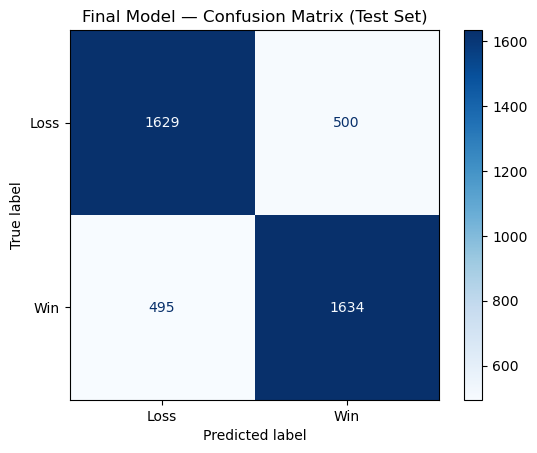
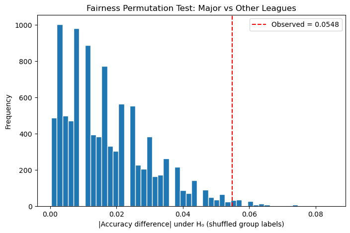

# League of Legends Esports: Action and Win Prediction

**Author:** Rei Gaddi  
**Course:** DSC 80, UCSD

League of Legends Esports: Action and Win Prediction is a data science project conducted for DSC 80 at UCSD. The project uses exploratory data analysis, hypothesis testing, and prediction models to investigate differences in playstyles across tier-one professional leagues and builds a classification model to predict match outcomes from the in-game state at the 15-minute mark.

## Step 1: Introduction

Developed by Riot Games, League of Legends (LOL) is a team-based strategy game where two teams of five players battle in a multiplayer online battle arena (MOBA). League of Legends' Esports scene is considered to be the largest in the world, with millions of viewers watching games across leagues worldwide. The dataset used for this project is the professional match data dataset from Oracle's Elixir. The file contains data of games played across the different professional leagues backed by Riot Games.

The Oracle's Elixir dataset includes individual and summarized team statistics that will allow us to see how teams play the game differently. From how many objectives teams take to how long each game is, I can study how teams make their own style work.

In League of Legends, each team is trying to destroy the other team's nexus, which is the main structure in a team's base. To destroy the nexus, players can level up and upgrade their character (champion) by killing monsters or opponents and buying items with the gold they get from slaying enemies. Additionally, there are smaller objectives in the form of larger monsters or structures that are meant to help teams upgrade their champions faster. Beyond the nexus and the turrets that guard it, teams compete for optional objectives like Dragons, Rift Heralds, and Barons — neutral monsters that grant powerful team-wide bonuses when slain. Taking these is optional, but they often shape the trajectory of the game.

This project explores the question: "Which tier-one professional leagues produce the most action-packed games, and how strongly does a team's state at 15 minutes determine the final result?" Play style is one of the most discussed and least quantified aspects of competitive League of Legends. While fans and analysts often describe some leagues as scrappy and others as methodical, most characterizations are based on anecdote rather than data. Measuring how much "action" actually differs across tier-one leagues can yield testable findings for teams, broadcasters, and Riot itself--whether for preparing for tournaments, targeting engaging content, and balancing the game. Quantifying play style can help build the foundation for questions about why regions play the way they do and whether style differences actually translate to competitive outcomes. Through my prediction model, I can see how the early-game state can predict the game's outcome.

The original raw dataset has 150348 rows and 165 columns, but only a handful of rows and columns will be used for this project.
Note: The columns below support both halves of the analysis — action metrics for the EDA, and 15-minute state features for the prediction model. For the EDA, the rows and columns will be filtered further.

| Column | Description |
|--------|-------------|
| `gameid` | Unique identifier for each game |
| `league` | The professional league the game was played in |
| `ckpm` | Combined kills per minute (sum of both teams' kills divided by game length in minutes) |
| `team kpm` | Kills per minute for the team |
| `dpm` | Damage to champions per minute (team-aggregate for team rows) |
| `damagetakenperminute` | Damage taken from champions per minute | 
| `dragons` | Total dragons taken by the team |
| `barons` | Total barons taken by the team |
| `heralds` | Total rift heralds taken by the team |
| `towers` | Total turrets destroyed by the team |
| `golddiffat15` | Gold difference at 15 min (team - opponent) |
| `xpdiffat15` | Experience difference at 15 min |
| `csdiffat15` | Creep Score (CS) difference at 15 min |
| `killsat15` | Kills the team had at 15 min |
| `result` | Result of the game (Win/Loss) |
| `side` | Side of the team (Red/Blue) |
| `gamelength` | Length of the Game (seconds) |

## Step 2: Data Cleaning and Exploratory Data Analysis

Here's a preview of the raw dataset (165 columns; scroll horizontally):

<div style="overflow-x:auto;">
<div>
<style scoped>
    .dataframe tbody tr th:only-of-type {
        vertical-align: middle;
    }

    .dataframe tbody tr th {
        vertical-align: top;
    }

    .dataframe thead th {
        text-align: right;
    }
</style>
<table border="1" class="dataframe">
  <thead>
    <tr style="text-align: right;">
      <th></th>
      <th>gameid</th>
      <th>datacompleteness</th>
      <th>url</th>
      <th>league</th>
      <th>year</th>
      <th>split</th>
      <th>playoffs</th>
      <th>date</th>
      <th>game</th>
      <th>patch</th>
      <th>...</th>
      <th>opp_csat25</th>
      <th>golddiffat25</th>
      <th>xpdiffat25</th>
      <th>csdiffat25</th>
      <th>killsat25</th>
      <th>assistsat25</th>
      <th>deathsat25</th>
      <th>opp_killsat25</th>
      <th>opp_assistsat25</th>
      <th>opp_deathsat25</th>
    </tr>
  </thead>
  <tbody>
    <tr>
      <th>0</th>
      <td>ESPORTSTMNT01_2690210</td>
      <td>complete</td>
      <td>NaN</td>
      <td>LCKC</td>
      <td>2022</td>
      <td>Spring</td>
      <td>0</td>
      <td>2022-01-10 07:44:08</td>
      <td>1</td>
      <td>12.01</td>
      <td>...</td>
      <td>203.0</td>
      <td>605.0</td>
      <td>-525.0</td>
      <td>9.0</td>
      <td>0.0</td>
      <td>1.0</td>
      <td>1.0</td>
      <td>0.0</td>
      <td>2.0</td>
      <td>0.0</td>
    </tr>
    <tr>
      <th>1</th>
      <td>ESPORTSTMNT01_2690210</td>
      <td>complete</td>
      <td>NaN</td>
      <td>LCKC</td>
      <td>2022</td>
      <td>Spring</td>
      <td>0</td>
      <td>2022-01-10 07:44:08</td>
      <td>1</td>
      <td>12.01</td>
      <td>...</td>
      <td>163.0</td>
      <td>421.0</td>
      <td>-903.0</td>
      <td>-28.0</td>
      <td>2.0</td>
      <td>4.0</td>
      <td>2.0</td>
      <td>1.0</td>
      <td>5.0</td>
      <td>1.0</td>
    </tr>
    <tr>
      <th>2</th>
      <td>ESPORTSTMNT01_2690210</td>
      <td>complete</td>
      <td>NaN</td>
      <td>LCKC</td>
      <td>2022</td>
      <td>Spring</td>
      <td>0</td>
      <td>2022-01-10 07:44:08</td>
      <td>1</td>
      <td>12.01</td>
      <td>...</td>
      <td>187.0</td>
      <td>-149.0</td>
      <td>-224.0</td>
      <td>-5.0</td>
      <td>1.0</td>
      <td>3.0</td>
      <td>0.0</td>
      <td>3.0</td>
      <td>4.0</td>
      <td>3.0</td>
    </tr>
    <tr>
      <th>3</th>
      <td>ESPORTSTMNT01_2690210</td>
      <td>complete</td>
      <td>NaN</td>
      <td>LCKC</td>
      <td>2022</td>
      <td>Spring</td>
      <td>0</td>
      <td>2022-01-10 07:44:08</td>
      <td>1</td>
      <td>12.01</td>
      <td>...</td>
      <td>284.0</td>
      <td>-1288.0</td>
      <td>-2005.0</td>
      <td>-85.0</td>
      <td>2.0</td>
      <td>1.0</td>
      <td>2.0</td>
      <td>3.0</td>
      <td>4.0</td>
      <td>0.0</td>
    </tr>
    <tr>
      <th>4</th>
      <td>ESPORTSTMNT01_2690210</td>
      <td>complete</td>
      <td>NaN</td>
      <td>LCKC</td>
      <td>2022</td>
      <td>Spring</td>
      <td>0</td>
      <td>2022-01-10 07:44:08</td>
      <td>1</td>
      <td>12.01</td>
      <td>...</td>
      <td>27.0</td>
      <td>499.0</td>
      <td>-314.0</td>
      <td>12.0</td>
      <td>1.0</td>
      <td>3.0</td>
      <td>2.0</td>
      <td>0.0</td>
      <td>7.0</td>
      <td>2.0</td>
    </tr>
  </tbody>
</table>
<p>5 rows × 165 columns</p>
</div>
</div>

For the cleanliness and efficiency of my analysis, I split the raw game data into two dataframes--one for the EDA analysis and one for the prediction models. 

In my EDA data, I filtered the rows to ones with team summary statistics for games in tier_one leagues, which include the LCK, LPL, LEC, LCS, CBLOL, PCS, VCS, LJL, LLA, and LCO (in 2022). The raw dataset contains rows for both players and their team, but only team statistics are needed for the EDA. Then, I keep the relevant columns: `gameid`, `league`, `ckpm`, `team kpm`, `dpm`, `damagetakenperminute`, `dragons`, `barons`, `heralds`, `towers`, and `gamelength`. I also created a new column, `gamelength_min`, which converts `gamelength` (originally in seconds) into minutes for readability.

**EDA data preview:**

<div style="overflow-x:auto;">
<div>
<style scoped>
    .dataframe tbody tr th:only-of-type {
        vertical-align: middle;
    }

    .dataframe tbody tr th {
        vertical-align: top;
    }

    .dataframe thead th {
        text-align: right;
    }
</style>
<table border="1" class="dataframe">
  <thead>
    <tr style="text-align: right;">
      <th></th>
      <th>gameid</th>
      <th>league</th>
      <th>ckpm</th>
      <th>team kpm</th>
      <th>dpm</th>
      <th>damagetakenperminute</th>
      <th>dragons</th>
      <th>barons</th>
      <th>heralds</th>
      <th>towers</th>
      <th>gamelength</th>
      <th>gamelength_min</th>
    </tr>
  </thead>
  <tbody>
    <tr>
      <th>34</th>
      <td>8401-8401_game_1</td>
      <td>LPL</td>
      <td>0.8352</td>
      <td>0.5714</td>
      <td>1762.0220</td>
      <td>2263.2527</td>
      <td>2.0</td>
      <td>1.0</td>
      <td>2.0</td>
      <td>8.0</td>
      <td>1365</td>
      <td>22.750000</td>
    </tr>
    <tr>
      <th>35</th>
      <td>8401-8401_game_1</td>
      <td>LPL</td>
      <td>0.8352</td>
      <td>0.2637</td>
      <td>1337.0110</td>
      <td>2541.8901</td>
      <td>1.0</td>
      <td>0.0</td>
      <td>0.0</td>
      <td>3.0</td>
      <td>1365</td>
      <td>22.750000</td>
    </tr>
    <tr>
      <th>58</th>
      <td>8401-8401_game_2</td>
      <td>LPL</td>
      <td>1.2465</td>
      <td>0.9141</td>
      <td>2482.5208</td>
      <td>3026.0526</td>
      <td>2.0</td>
      <td>1.0</td>
      <td>2.0</td>
      <td>9.0</td>
      <td>1444</td>
      <td>24.066667</td>
    </tr>
    <tr>
      <th>59</th>
      <td>8401-8401_game_2</td>
      <td>LPL</td>
      <td>1.2465</td>
      <td>0.3324</td>
      <td>1459.6537</td>
      <td>3107.1607</td>
      <td>1.0</td>
      <td>0.0</td>
      <td>0.0</td>
      <td>2.0</td>
      <td>1444</td>
      <td>24.066667</td>
    </tr>
    <tr>
      <th>82</th>
      <td>8402-8402_game_1</td>
      <td>LPL</td>
      <td>0.6339</td>
      <td>0.3803</td>
      <td>1719.9366</td>
      <td>2528.4945</td>
      <td>4.0</td>
      <td>2.0</td>
      <td>0.0</td>
      <td>10.0</td>
      <td>1893</td>
      <td>31.550000</td>
    </tr>
  </tbody>
</table>
</div>
</div>

As for the prediction data, I filtered for team statistics and rows where the *at15 columns are guaranteed to be populated. (indicated by `datacompleteness`). Then, I kept the relevant columns for my prediction data: `gameid`, `league`, `side`, `result`, `golddiffat15`, `xpdiffat15`, `killsat15`, and `csdiffat15`. Note this `datacompleteness` filter automatically excludes LPL entirely, since LPL's 2022 games have full action stats but no at-15 timeline data--the same pattern my missingness analysis examines. It's also important to note that I didn't have to check `datacompleteness` for my EDA data because `datacompleteness` will not equal 'complete' if mid-game stats were not recorded for that game (ex. `golddiffat15`). Since I did not need mid-game stats for my EDA, `datacompleteness` was not used for filtering.

**Prediction data preview:**

<div style="overflow-x:auto;">
<div>
<style scoped>
    .dataframe tbody tr th:only-of-type {
        vertical-align: middle;
    }

    .dataframe tbody tr th {
        vertical-align: top;
    }

    .dataframe thead th {
        text-align: right;
    }
</style>
<table border="1" class="dataframe">
  <thead>
    <tr style="text-align: right;">
      <th></th>
      <th>gameid</th>
      <th>league</th>
      <th>side</th>
      <th>result</th>
      <th>golddiffat15</th>
      <th>xpdiffat15</th>
      <th>killsat15</th>
      <th>csdiffat15</th>
    </tr>
  </thead>
  <tbody>
    <tr>
      <th>10</th>
      <td>ESPORTSTMNT01_2690210</td>
      <td>LCKC</td>
      <td>Blue</td>
      <td>0</td>
      <td>107.0</td>
      <td>-1617.0</td>
      <td>5.0</td>
      <td>-23.0</td>
    </tr>
    <tr>
      <th>11</th>
      <td>ESPORTSTMNT01_2690210</td>
      <td>LCKC</td>
      <td>Red</td>
      <td>1</td>
      <td>-107.0</td>
      <td>1617.0</td>
      <td>6.0</td>
      <td>23.0</td>
    </tr>
    <tr>
      <th>22</th>
      <td>ESPORTSTMNT01_2690219</td>
      <td>LCKC</td>
      <td>Blue</td>
      <td>0</td>
      <td>-1763.0</td>
      <td>-906.0</td>
      <td>1.0</td>
      <td>-22.0</td>
    </tr>
    <tr>
      <th>23</th>
      <td>ESPORTSTMNT01_2690219</td>
      <td>LCKC</td>
      <td>Red</td>
      <td>1</td>
      <td>1763.0</td>
      <td>906.0</td>
      <td>3.0</td>
      <td>22.0</td>
    </tr>
    <tr>
      <th>46</th>
      <td>ESPORTSTMNT01_2690227</td>
      <td>LCKC</td>
      <td>Blue</td>
      <td>1</td>
      <td>1191.0</td>
      <td>2298.0</td>
      <td>3.0</td>
      <td>15.0</td>
    </tr>
  </tbody>
</table>
</div>
</div>

After cleaning the data, I performed univariate analysis on `ckpm` (Combined Kills per Minute), which will be used to quantify "action".

<iframe src="assets/ckpm_hist.html" style="width:100%;height:440px;border:none;overflow:hidden;" scrolling="no" loading="lazy"></iframe>

Combined kills per minute is unimodal, right-skewed, and centered around 0.7-0.8, which is expected for games that cluster around a moderate tempo and a minority of games reaching high kill counts. This non-normality motivated using a permutation test rather than relying on the F-distribution for the hypothesis test.

Additionally, I plotted the distribution of `ckpm` grouped by `league` to visualize how each league differs in playstyles.

<iframe src="assets/ckpm_box.html" style="width:100%;height:440px;border:none;overflow:hidden;" scrolling="no" loading="lazy"></iframe>

Combined kills per minute varies notably across leagues (LCK with the lowest median, while VCS and LCO sit highest), which tracks with regional stylistic reputations: LCK is known for slower, objective-focused play, while VCS is known for chaotic, fight-heavy games. The visible separation in medians motivated formally testing whether action levels differ across tier-one leagues.

For a more precise look on the different ckpm values in comparison to other game data, I made a pivot table showing the average kills, damage, dragons (objective), and game lengths.

<div style="overflow-x:auto;">
<div>
<style scoped>
    .dataframe tbody tr th:only-of-type {
        vertical-align: middle;
    }

    .dataframe tbody tr th {
        vertical-align: top;
    }

    .dataframe thead th {
        text-align: right;
    }
</style>
<table border="1" class="dataframe">
  <thead>
    <tr style="text-align: right;">
      <th></th>
      <th>ckpm</th>
      <th>dpm</th>
      <th>dragons</th>
      <th>gamelength_min</th>
    </tr>
    <tr>
      <th>league</th>
      <th></th>
      <th></th>
      <th></th>
      <th></th>
    </tr>
  </thead>
  <tbody>
    <tr>
      <th>CBLOL</th>
      <td>0.874</td>
      <td>2016.541</td>
      <td>2.311</td>
      <td>32.901</td>
    </tr>
    <tr>
      <th>LCK</th>
      <td>0.700</td>
      <td>1906.103</td>
      <td>2.412</td>
      <td>33.668</td>
    </tr>
    <tr>
      <th>LCO</th>
      <td>0.960</td>
      <td>2044.020</td>
      <td>2.231</td>
      <td>30.383</td>
    </tr>
    <tr>
      <th>LCS</th>
      <td>0.733</td>
      <td>1948.195</td>
      <td>2.270</td>
      <td>33.026</td>
    </tr>
    <tr>
      <th>LEC</th>
      <td>0.804</td>
      <td>2045.364</td>
      <td>2.208</td>
      <td>33.221</td>
    </tr>
    <tr>
      <th>LJL</th>
      <td>0.778</td>
      <td>1887.417</td>
      <td>2.288</td>
      <td>32.022</td>
    </tr>
    <tr>
      <th>LLA</th>
      <td>0.804</td>
      <td>1993.715</td>
      <td>2.257</td>
      <td>33.159</td>
    </tr>
    <tr>
      <th>LPL</th>
      <td>0.839</td>
      <td>2026.231</td>
      <td>2.214</td>
      <td>31.557</td>
    </tr>
    <tr>
      <th>PCS</th>
      <td>0.833</td>
      <td>1921.004</td>
      <td>2.198</td>
      <td>30.949</td>
    </tr>
    <tr>
      <th>VCS</th>
      <td>1.052</td>
      <td>2184.712</td>
      <td>2.068</td>
      <td>30.031</td>
    </tr>
  </tbody>
</table>
</div>
</div>

Aggregating by league reveals that action level, game length, and objective accumulation move together: VCS has the highest combined kills per minute (1.052) alongside the shortest average games (30.031 min) and the fewest dragons (2.068), while slower leagues like LCK (0.700 ckpm) play longer games (33.668 min) and secure more dragons (2.412). The inverse relationship between pace and slow objectives is why I used raw objective counts rather than per-minute rates in this analysis--normalizing dragons by game length would change the pace differences already captured by ckpm.

## Step 3: Assessment of Missingness

Among the columns relevant to my analysis, I don't believe any are clearly NMAR. The columns I use for the EDA (`ckpm`, `team kpm`, `dragons`, etc.) are fully present in the rows I use.  For my prediction model, the columns I rely on (`golddiffat15`, `xpdiffat15`, `killsat15`, `csdiffat15`) have substantial missingness, but it isn't NMAR as there is no mechanism by which a team's gold lead would cause unrecorded values. The missingness is due to how timeline data was collected: certain leagues' 2022 games weren't tracked at the timeline level. This points to MAR, since the missingness depends on the observed `league` column, which I confirm below. To strengthen this conclusion, additional metadata about the league's broadcast and data-tracking arrangements in 2022 (some leagues transferred data to Oracle's Elixir via API, while others might've been web scraped or had data-sharing disallowed) would help confirm that missingness is explained by `league`.

**Null Hypothesis:** The missingness of `golddiffat15` does not depend on `league` and the distribution of leagues is the same whether gold data is missing or present.
<br>
**Alternative Hypothesis:** The missingness of `golddiffat15` depends on `league` and the league distributions differ between missing and present rows.

**Permutation test results:**

```
Missingness vs League:  TVD = 0.9926, p = 0.0
Missingness vs Side:    TVD = 0.0,    p = 1.0
```

To assess what the missingness of `golddiffat15` depends on, I created a boolean `gold_missing` column and ran permutation tests using total variation distance (TVD) as the test statistic because the grouping columns (league, side) are categorical. For each test, the TVD measures how different the distribution of the grouping column is between rows where `golddiffat15` is missing versus present. I then shuffled the missingness labels to build the null distribution of TVDs expected if missingness were unrelated to that column.

As shown from the p-value (p ≈ 0.0), Missingness does depend on league: the leagues with missing gold data are almost fully disjoint from those with present data. Furthermore, missingness does not depend on side (p = 1.0): Blue and Red are split identically across missing and present rows, since both teams in any game share the same data-completeness status.

<iframe src="assets/tvd_null.html" style="width:100%;height:440px;border:none;overflow:hidden;" scrolling="no" loading="lazy"></iframe>

The observed TVD (Observed ≈ 0.993) lies far to the right of the entire null distribution under the null of no dependence. This is strong evidence that `golddiffat15` missingness depends on league, consistent with the MAR characterization above: whole leagues' games are missing timeline data due to upstream data-collection differences, not due to the gold values themselves.

## Step 4: Hypothesis Testing

To investigate whether action levels differ across tier-one leagues, I tested whether the mean `ckpm` varies by `league`.

**Null hypothesis:** Mean `ckpm` is the same across all tier-one leagues.
<br>
**Alternative hypothesis:** At least one league's mean `ckpm` differs from the others.

**Test statistic:** One-way ANOVA F-statistic, measuring the ratio of between-league variance to within-league variance.
<br>
**Significance level:** α = 0.05.

Because my earlier EDA showed `ckpm`is right-skewed and non-normal, which violates the normality assumption of ANOVA, I did not rely on the theoretical F-distribution for my p-value. Instead, I computed the F-statistic on the observed data and then ran a permutation test (10,000 shuffles): I shuffled the league labels, recomputed the F-statistic under each shuffle, and built an empirical null distribution of F-values expected if league had no relationship to ckpm.

**Test results:**

```
Observed F-statistic: 122.629
Permutation p-value:  ~0 (no shuffle exceeded the observed F)
```

The observed F-statistic was 122.629, and the permutation p-value was ≈ 0. Since this is far below α = 0.05, I reject the null hypothesis. There is strong evidence that mean combined kills per minute may differ across tier-one leagues. This finding is consistent with the per-league variation seen in my earlier boxplot, where leagues like LCK and VCS sat at opposite ends of the action spectrum.

Here is a histogram that displays the observed f-statistic in comparison to the generated null distribution:

<iframe src="assets/fstat_null.html" style="width:100%;height:440px;border:none;overflow:hidden;" scrolling="no" loading="lazy"></iframe>

The observed F-statistic lies far beyond the entire null distribution. Under the null of no league effect, an F-statistic this extreme essentially never happens by chance, which is why the p-value is approximately zero.

## Step 5: Framing a Prediction Problem

In the last section, I showcased how professional leagues differ in playstyles. Now, I will build a prediction model to see how teams' playstyles can affect their win rate. Specifically, I will try to answer the question: How strongly does a team's early-game state at the 15-minute mark predict the final result?

I framed this as a binary classification problem, with result (1 = win, 0 = loss) as the response variable. The features available at the 15-minute mark, like 'golddiffat15', and pre-game information, like 'side', capture a team's standing at the time of prediction and reflect the constraint of information for any live in-broadcast prediction system. Choosing 'result' as the response variable gives us a clear way to evaluate the prediction model's performance. 

For the evaluation metric, I chose to use accuracy since predicting wins and losses is equally valuable. The dataset is balanced (50% wins, 50% losses), so accuracy is not inflated by majority-class predictions. To confirm this, I will also compute the F1-score and compare it to the model's accuracy--F1 should be close to accuracy if the model performs symmetrically across wins and losses.

## Step 6: Baseline Model

My baseline logistic regression model uses two features--one quantitative ('golddiffat15') and one nominal ('side'). To standardize 'golddiffat15', I used StandardScaler(). Since the sides are perfectly collinear, I used OneHotEncoder() on 'side' to avoid multicollinearity.

**Baseline performance:**

```
Training accuracy: 0.7376
Test accuracy:     0.7607
Test F1-score:     0.7607
```

The baseline model achieved a training accuracy score of 0.7376 and a test accuracy score of 0.7607, meaning that the model was accurate for 73.76% of observations in the training dataset and 76.07% of observations in the test dataset. Since both accuracy scores are well over the 50% mark, I'd say that the model performs fairly well with room for improvement. Since the gap between training and test accuracy is small, it's safe to say that the model does well in generalizing to unseen data.

## Step 7: Final Model

In my final model, I switched to a RandomForestClassifier instead of LogisticRegression because I wanted to capture possible non-linear relationships and interactions between features and the game outcome that a linear model can't represent. For example, the idea that a gold lead only becomes decisive past a certain threshold, or that an advantage matters more when it shows up across several dimensions at once. I also added the features `xpdiffat15`, `killsat15`, and `csdiffat15`. 

These features are good choices because each captures a distinct dimension of a team's 15-minute advantage that gold alone doesn't fully express. `xpdiffat15` reflects an experience lead, which governs champion power spikes (certain champions become stronger at certain levels) independently of gold. `killsat15` captures kill-based tempo and map pressure--a team can be even in gold but ahead in kills, signaling momentum. `csdiffat15` measures a farm-based economy lead, a different route to an advantage than kills. Two teams with identical gold leads can have built them very differently, and that composition plausibly affects how reliably the lead converts to a win. While these features are correlated with `golddiffat15` (gold is partly composed of kill and CS gold), a tree-based model handles correlated inputs without the instability it would cause in a linear model.

In this model, I did not apply a `StandardScaler` to the numeric features because a `RandomForestClassifier` is scale-invariant, meaning that standardizing would not affect the model's predictions. The only encoding needed is `OneHotEncoder(drop='first')` on `side`.

To select hyperparameters, I used `GridSearchCV` over n_estimators(100, 200, 300), max_depth(3, 5, 8, None), and min_samples_leaf(1, 5, 20), scoring on accuracy. Furthermore, I used `GroupKFold` grouped by `gameid` for the cross-validation rather than ordinary k-fold because each game has one row for each side teams are on. Grouping by game keeps both rows of any game in the same fold, preventing data leakage in the cross-validation during tuning. The best combination was `max_depth=5, min_samples_leaf=1, n_estimators=100`, with a cross-validated accuracy of 0.744.

**Final model performance:**

```
Best params: max_depth=5, min_samples_leaf=1, n_estimators=100
Best CV accuracy:    0.7441

Final train accuracy: 0.7477
Final test accuracy:  0.7663
Final test F1:        0.7666
```

I evaluated the final model on the same test set as the baseline. The final model achieved 76.63% test accuracy, a slight improvement over the baseline (76.07%). This suggests that the 15-minute gold lead already captures most of the linear signal about the result, with the additional features and non-linear model contributing incremental gains on top. The train and test accuracies remain close (0.7477 vs. 0.7663), indicating the tuned model generalizes well rather than overfitting.

<p align="center"></p>

The confusion matrix is nearly symmetric (500 false positives, 495 false negatives) with equal class support (2,129 each), reflecting the data's structure: every game contributes exactly one win row and one loss row, so the test set is fairly balanced and the model shows no bias toward either class.

## Step 8: Fairness Analysis

Finally, I will conduct a fairness analysis to see if my prediction model predicts fairly for different groups. In competitive esports, play styles and skill levels vary widely across regions, so the question I'm focusing on is: **Does the model perform differently for games in the major leagues compared to games in other, less globally-renowned leagues?** 

Group X will be the major tier-one leagues (LCS, LEC, LCK) and Group Y is all other professional leagues in my prediction data. Since my prediction data is filtered on `datacompleteness` rather than tier-one status, Group Y consists largely of regional and academy leagues (e.g. LCKC, NEXO) rather than other tier-one leagues. Like my prediction models, I will be using accuracy as my evaluation metric because the test set is balanced and both error types are equally costly. As my test is two-sided, my test statistic is the absolute difference of accuracies with a significance level of α = 0.05.

**Null Hypothesis:** The model is fair, meaning its accuracy on major leagues (LCS, LEC, LCK) and on other leagues is the same.
<br>
**Alternate Hypothesis:** The model is unfair, meaning its accuracy differs between the two groups.

**Permutation test results:**

```
Group X (major) rows: 406
Group Y (other) rows: 3852

Accuracy — major: 0.7167
Accuracy — other: 0.7715
Observed |difference|: 0.0548
p-value: 0.0154
```

<p align="center"></p>

With a p-value of 0.0154, p < α = 0.05 and I reject my null hypothesis. It seems that my model does perform different when analyzing major tier-one leagues in comparison to other leagues. This could be because early leads in the highest level of games are less deterministic, as top-tier players are more prepared to adapt to dire and uncomfortable situations. That said, the estimate for major leagues is based on a much smaller sample (406 rows vs. 3,852), so while the difference is statistically significant, the size of the gap should be read with the imbalance in mind.
